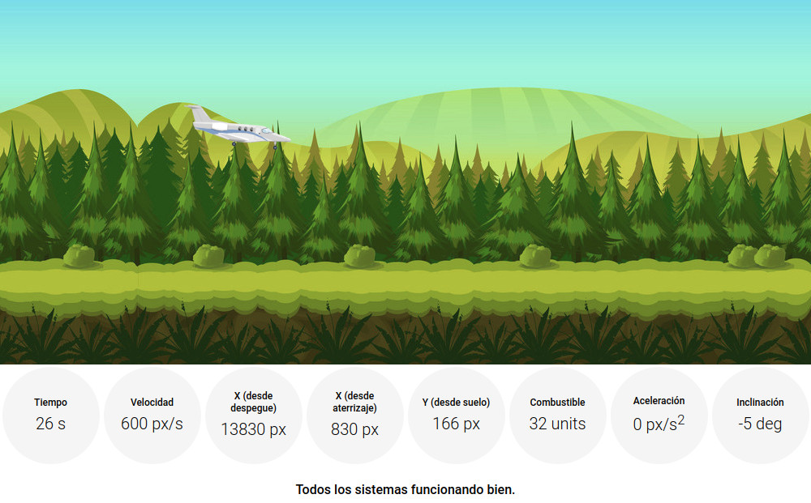

# Jest Workshop

[](http://romelperez.com)
[](https://jestjs.io)
[](./LICENSE)

Taller básico de introducción a testing de aplicaciones web basadas en JavaScript
con [la librería Jest](https://jestjs.io). El recorrido está enfocado en unit
testing usando la metodología [Test-Driven Development (TDD)](https://en.wikipedia.org/wiki/Test-driven_development)
en [Node.js](https://nodejs.org).

Apoyado en la charla [**Testing en JavaScript con Jest**](https://romelperez.com/talks/testing-javascript-jest).

## Workshop

El taller consiste en arreglar un sistema animado autocontrolado de aterrizaje
de un avión en vuelo.

Un elemento que representa un avión debe tener un sistema automático de aterrizaje
que tomará acción cuando se entre en la zona de aterrizaje. Se desacelerará hasta
llegar a velocidad 0 y debe descender hasta tocar suelo.

Si alguna de las siguientes condiciones se cumple, el avión explotará:

- Está volando por encima de 300 pixeles.
- Toca el suelo por debajo de 10 pixeles.
- Su velocidad es muy baja cuando está en el aire.
- Se queda sin combustible.
- Accelera a más de 100 px/s2.
- Va a más de 300 px/s en el suelo.

El objetivo es aterrizar el avión y que se encuentre a velocidad 0 px/s,
aceleración 0 px/s2, una altura muy cercana a 0, una velocidad muy cercana a 0,
con combustible, dentro de la zona de aterrizaje.



Esta es la versión final del taller.

### Clonar

```bash
$ git clone https://github.com/romelperez/jest-workshop.git
$ cd jest-workshop
```

### Instalar

```bash
$ npm install
```

### Ejecutar

```bash
$ npm run start
```

### Testear

```bash
# check linting errors
$ npm run lint

# run tests only once
$ npm run test

# run tests with watcher
$ npm run test-dev
```
